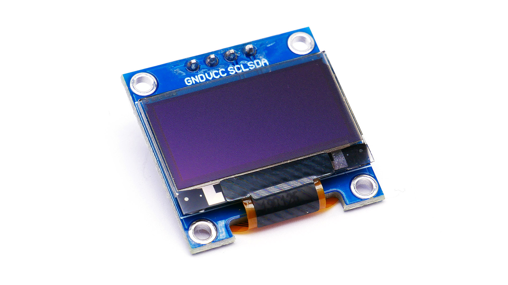

# SSD1306 OLED

SSD1306 is a popular controller for OLED screens

resolution 128x64

I2C communication requires only 4 pins: GND, VCC, SDA, SCL 

SDA > A4

SCL > A5

Check if the I2C address is 0x3D or 0x3C

Power consumption: according to https://bitbanksoftware.blogspot.com/2019/06/how-much-current-do-oled-displays-use.html,  for text (~50% pixels at 100%) is around 10mA so at 5V is ~50mW 

## Useful references

* A tool to design pixelart: https://www.pixilart.com/

* Check out wokwi online emulator https://wokwi.com/ for Arduino, ESP32 and Raspberry Pi Pico and animation maker https://animator.wokwi.com/

  Using the wokwi emulator I made code to display distance measurements, check:

  * parking_sensor: https://wokwi.com/projects/380210366387901441
  * distance_measurement: https://wokwi.com/projects/380210201131269121

* Check out also this image2cpp tool to make byte arrays from images and viceversa: http://javl.github.io/image2cpp/