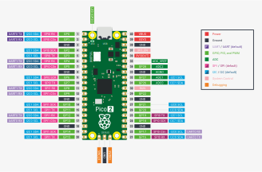

# Raspberry Pi Pico WH


### RPi Pico WH pinout



### Flashing MicroPython onto the Pico

I used [Thonny](https://thonny.org/) (a python IDE for beginners with great MicroPython integration). 

1. Install and run:

```bash
$ sudo apt install thonny
$ thonny
```

2. Plug the RPi Pico in boot mode: while holding down the **BOOTSEL** button on the RPi Pico, connect the USB cable to your computer, and a new drive will appear: **RPI-RP2**

3. flash MicroPython on the RPi Pico: 
   1. Go to **Tools** > **Options**
   2. In the **Interpreter** tab select **"MicroPython (Raspberry Pi Pico)"** in the dropdown and click **"Install or update MicroPython"**. Thonny will detect the RPi Pico automatically. 
   3. Select variant **"Raspberry Pi Pico W / Pico WH"**. It will download and flash the **MicroPython UF2 file** automatically.
   4. Click **Install** and wait for it to finish
   5. After install, the RPi Pico will reboot and connect directly to Thonny — you’ll see the MicroPython REPL (>>>) at the bottom.