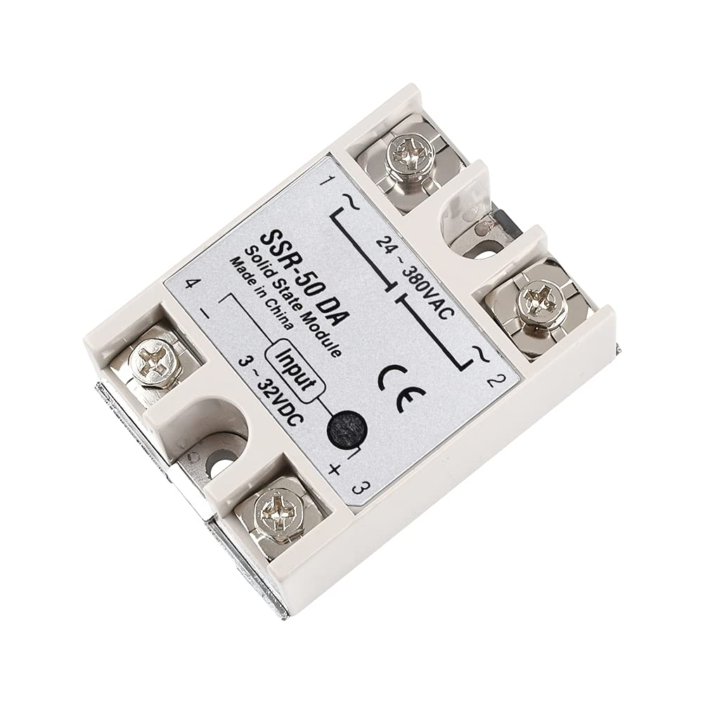

# diymore SSR-50 DA Solid State Relay

See: https://www.amazon.es/dp/B08FX1DDJM

Dimensions : ‎ 9,3 x 7,2 x 2,4 cm; 100 g
Manufacturer ‏ : ‎ diymore
ASIN ‏ : ‎ B08FX1DDJM
Manufacturer Reference ‏ : ‎ D010158

DC in: 3-32V DC

AC out: 24-380 VAC up to 50A

## References

Datasheets of similar products can be found [online](https://www.alldatasheet.com/datasheet-pdf/view/1940532/ETC/SSR50DA.html). I saved a local backup [here](../assets/SSR-40DA_datasheet.PDF).

A good reference: [Solid State Relay guide by phidgets](https://www.phidgets.com/docs/Solid_State_Relay_Guide?srsltid=AfmBOorru7Hbru1xUMTdGQiQV_bOGTrxNW5RF4knFHSb9Xe7WTeGPxXw#Hooking_up_wires_to_the_Hockey_Puck_SSR) 

According to **Practical Electronics by Inventors, sections 3.4.1 and 3.4.2** protecting tyhe Piuco with a diode seems unnecessary for my application, but also harmless. I decided to install a 1N4007. 

On the other hand it may be a good idea to add also a [plastic cover](https://es.aliexpress.com/item/1005002904930594.html) and a [heat sink]()