# DIY reflow oven

Inspired in [this video](https://www.youtube.com/watch?v=asZ1zhef8Ss) (see also the [blog post](https://www.digikey.com/en/maker/projects/how-to-build-a-solder-reflow-oven/6c52df4782084f8d97c62d1349df058f)), but I thought the BOM was too expensive. I used also [this video](https://www.youtube.com/watch?v=k9xzGO0SVg0) as inspiration, which discusses temperature curves, and includes a custom controller PCB.

Bought the following elements instead:

| Qty  | Item                                                         | Image                                      | Description                                                  | Link                                          | Pack Price (€) | Pack Size | Unit Price (€) | Subtotal (€) |
| ---- | ------------------------------------------------------------ | ------------------------------------------ | ------------------------------------------------------------ | --------------------------------------------- | -------------- | --------- | -------------- | ------------ |
| 1    | [ARCELI MAX6675 module + K-type thermocouple](./BOM/sensor.md) | 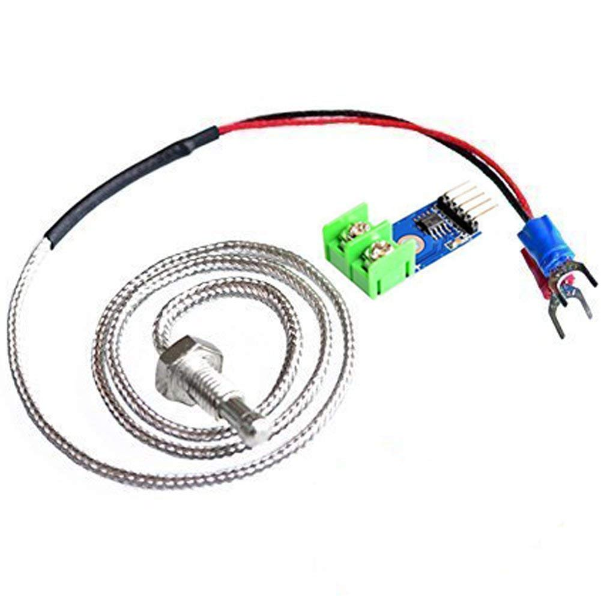               | K-type thermocouple module with MAX6675, 0–600 °C range, SPI output | [Amazon](https://www.amazon.es/dp/B07MY36P9Y) | 7.99           | 1         | 7.99           | 7.99         |
| 1    | [SSR-50DA Solid State Relay](./BOM/ssr.md)                   | 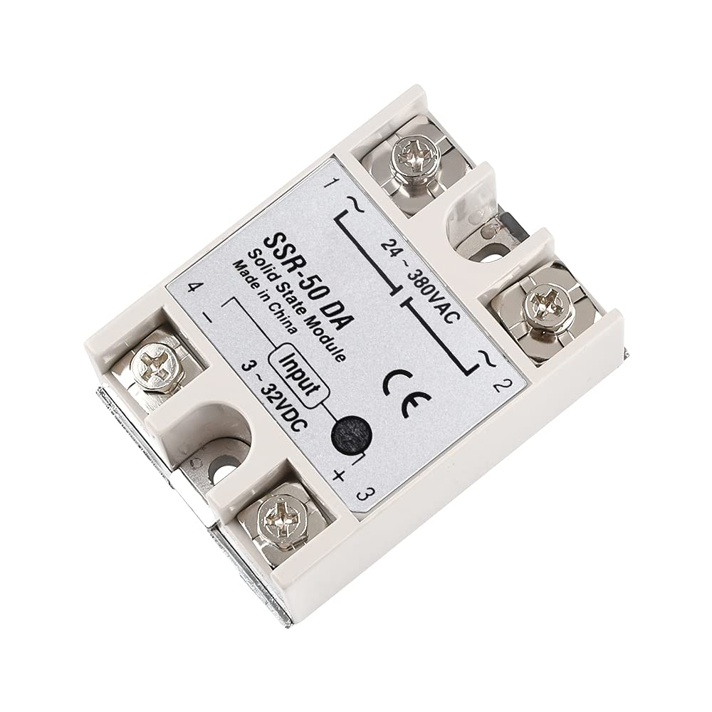                  | DC 3–32 V input, AC 24–380 V output, 50A max, for heater control | [Amazon](https://www.amazon.es/dp/B08FX1DDJM) | 9.59           | 1         | 9.59           | 9.59         |
| 1    | [Cecotec Bake&Toast 1090 Oven](./BOM/oven.md)                | 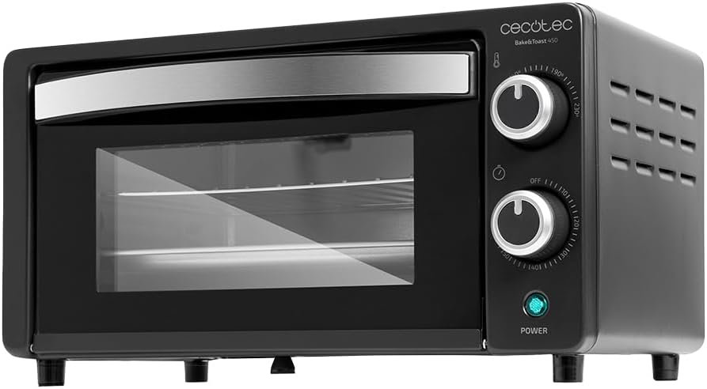                 | 10 L tabletop oven, 1000 W, 60 min timer, up to 230 °C       | [Amazon](https://www.amazon.es/dp/B0BQ13YSVT) | 31.90          | 1         | 31.90          | 31.90        |
| 1    | [Raspberry Pi Pico WH](BOM/RPi_Pico.md)                      | 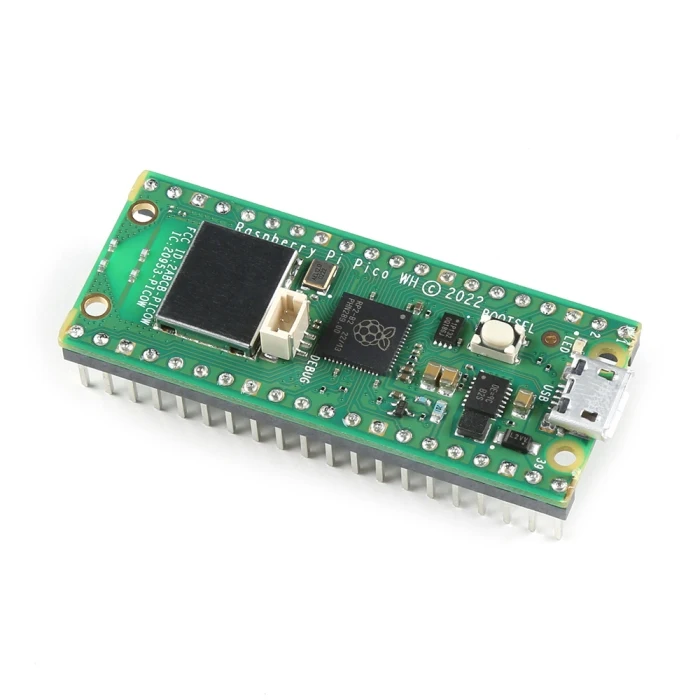 |                                                              |                                               |                |           |                |              |
| 1    | [SSD1306 OLED](./BOM/OLED.md)                                |                  |                                                              |                                               |                |           |                |              |

I already had the Raspberry Pico WH and SSD1306 OLED screen laying around.

See [BOM/RPi_Pico.md](BOM/RPi_Pico.md) for  instructions on how to flash micropython on to the Raspberry Pi Pico and details of the pinout.

## Step 1 - Measure temperature and show it on the OLED

Target: display the temperature on the OLED using a MicroPython script

Inspired in this source video: https://www.youtube.com/watch?v=aUPvASe8D-w

### Wiring

While I wait for the thermocouple to arrive by post I am building a proof of concept using a 10K thermistor and a 10kOhms resistor from my trusted [Freenove_Ultimate_Starter_Kit_for_Raspberry_Pi](https://github.com/Freenove/Freenove_Ultimate_Starter_Kit_for_Raspberry_Pi), wired in a voltage divider configuration as shown below (actually one of the tutorials in this repo demonstrates this application).

```
3.3V --- [10kΩ] ---+--- [10K Thermistor] --- GND
                   |
                GPIO26 (ADC 0)
```

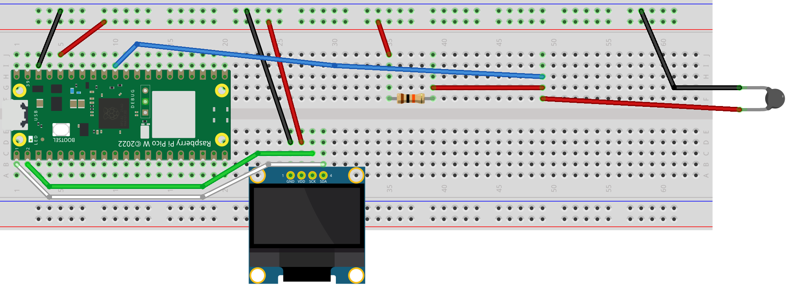

Check out the [fritzing model](./fritzing/diy_reflow_oven_v1.fzz)

### Firmware

* `main.py` - main function
* `display.py` - functions to send info to the OLED display  
* `thermistor.py` -  functions to read the sensor. Note I used a very simplified model of the variation of the thermistor's resistance with temperature using a single constant. This [Online Steinhart-Hart model coefficients calculator]( https://www.thinksrs.com/downloads/programs/therm%20calc/ntccalibrator/ntccalculator.html) provides a more accurate model but requires making R measurements at 3 known T points, which I felt was an overkill for the proof of concept.

Copy dependencies to the Pico:

* `ssd1306.py` - library to communicate with the OLED (copied from https://github.com/stlehmann/micropython-ssd1306)
* `writer.py` - an interpreter for custom fonts for the OLED  (copied from the link in the comments of this video: https://www.youtube.com/watch?v=bLXMVTTPFMs)
* `freesans20.py` - a custom large font for the OLED  (copied from the link in the comments of this video: https://www.youtube.com/watch?v=bLXMVTTPFMs)

Note: the files from https://github.com/peterhinch/micropython-font-to-py did not work for me.

## Step 2  - setup a web server over WiFi to interact from computer or phone

Profiting from the capabilities of the RPi Pico I decided to set up a local web server over Wifi to view temperature readings from a computer or phone connected to the same Wifi network as the Pico

### Firmware

* `wifi.py` : function to connect the RPi Pico to Wifi. Requires uploading to the Pico a `secrets.py` file containing the network information as follows:

```bash
SSID = "Network"
PASSWORD = "Password"
```

* `server.py` :  a very basic web server that just publishes the temperature every 2 seconds

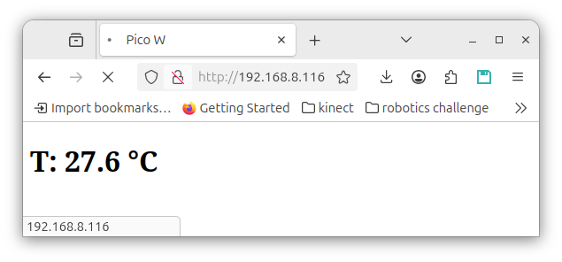

## Step 3 - Control the heater

Next we refactor using the [Microdot](https://github.com/miguelgrinberg/microdot) framework and add a few improvements:

* Replace repeated full-page reload every 2 seconds using meta-refresh with polling a tiny JSON file using Java Script. This is more efficient, avoids page flicker and is more extensible 
* Save web page as static files (`index.html` and `style.css`) with a minimalistic, modern design
* Add `/set_target?value=XX` route to update target temperature via HTTP
* Add REST endpoint `/temperature` exposing current and target temp + heater state

* `heater.py` - contains the target temperature logic and functions to control a heater in GPIO22

Dependencies: copy the library  `microdot.py` to the pico

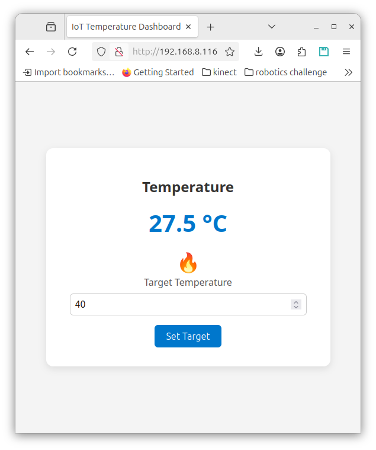

### Wiring

In preparation to control the heater we add an LED on GPIO22

Check out the [fritzing model](./fritzing/diy_reflow_oven_v2.fzz)

| 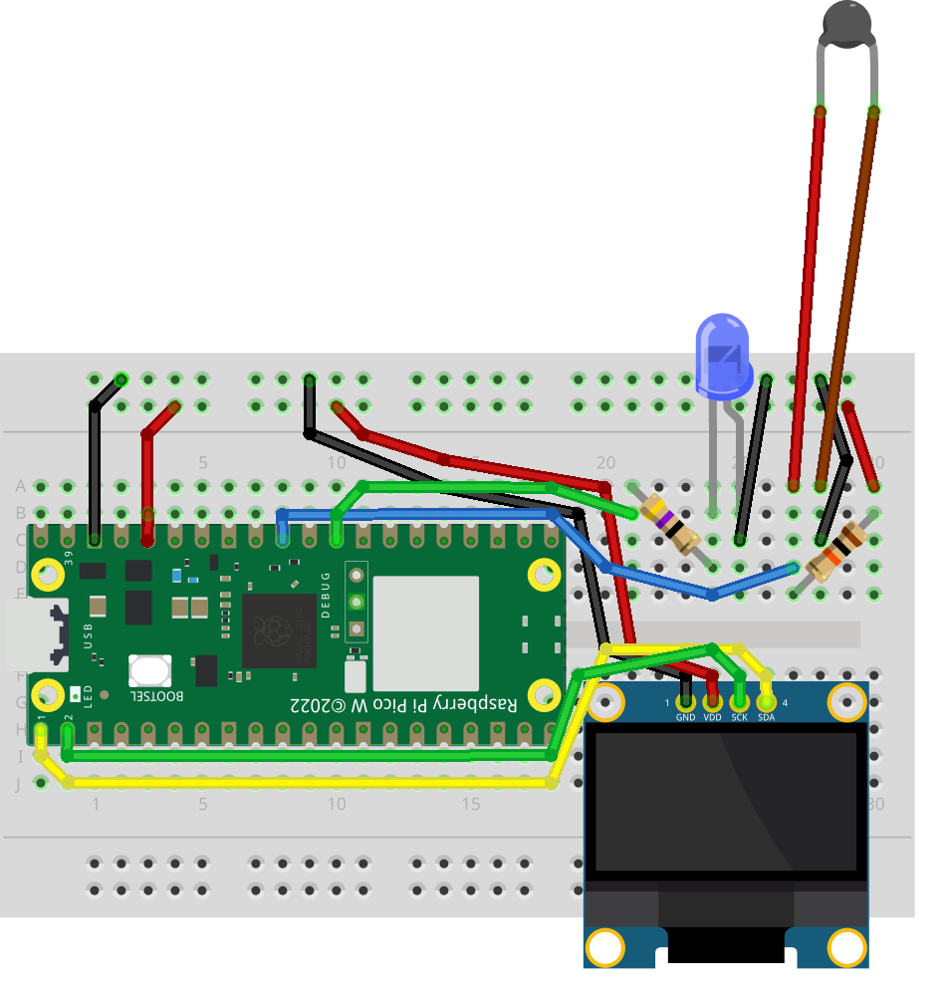 | 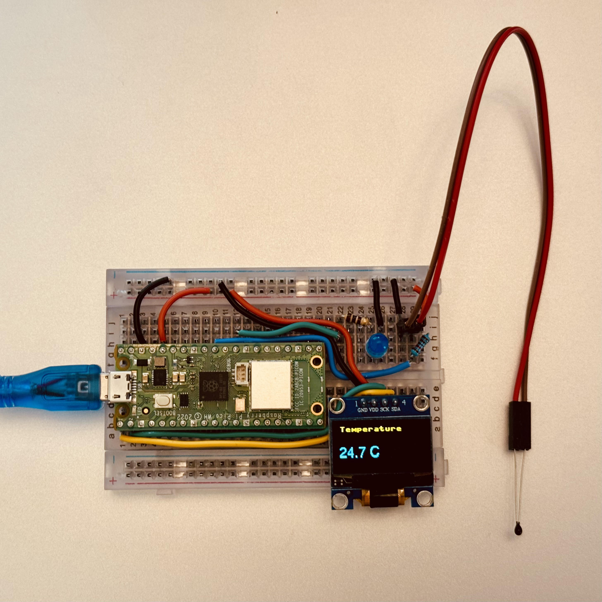 |
| ---------------------------------- | -------------------------------------------------------- |

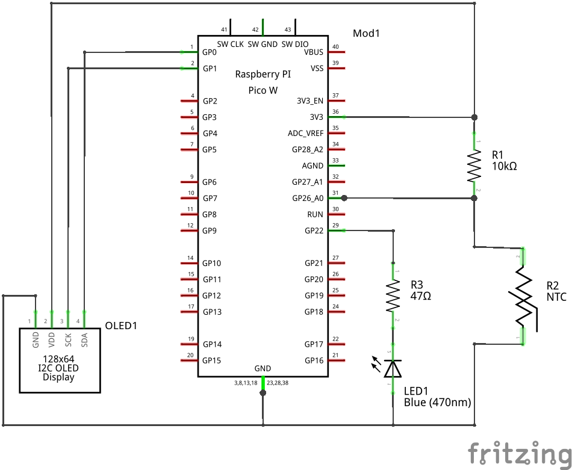

## Step 4 - Temperature Profiles

Next we refactor to add support for temperature profiles and disable manual target temperature setting:

- `profile.py` - classes for multi-phase temperature control with JSON serialization
- `profile_manager.py` functions to manage profile execution, file persistence, and state tracking
- new `profiles/` folder to store temperature profiles as JSON files
  - [low_temp.json](./src/profiles/low_temp.json) profile based on [this datasheet](./assets/low_temp_solder_paste_datasheet.pdf) for Sn42Bi57Ag1 Low Temperature Solder Paste


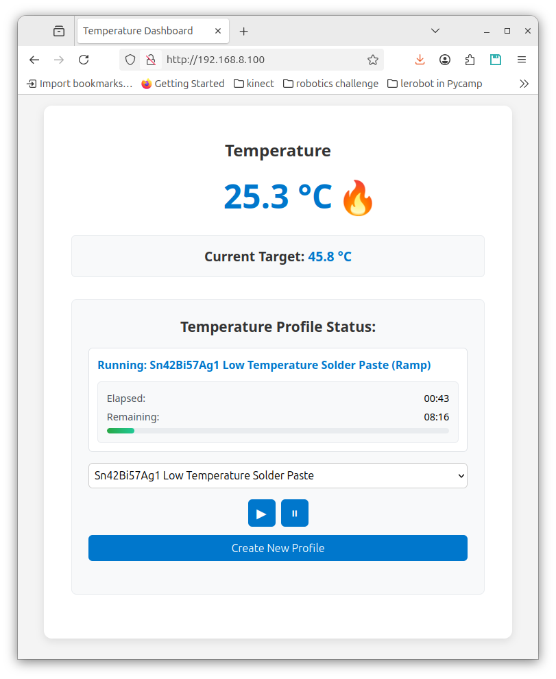

## Step 5 - Plot temperature graphs

This is a test with simulated temperature

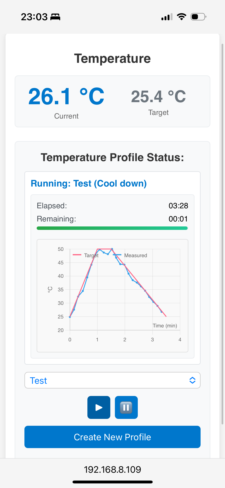

## Step 5 - Optimize architecture

Move state logic to `ProfileManager` class, put some order in the UI, improve set of example profiles etc.

**Bulb Test 55 °C — Proof of Concept**

The graph below shows a temperature profile recorded during a full system test in a simple proof-of-concept setup. An old incandescent bulb served as the heating element, switched by the Raspberry Pi Pico via a solid-state relay connected to GPIO22 . To mimic an oven enclosure, the bulb and temperature sensor were covered with an inverted beer glass, allowing the air temperature to rise quickly to the 55 °C target.

The small ripples in the measured temperature trace reflect the heater control loop cycling the bulb on and off to follow the requested profile. Towards the end of the test, the measured temperature fell behind the target curve because heat dissipation under the glass was not fast enough to achieve the desired cooling rate.

| 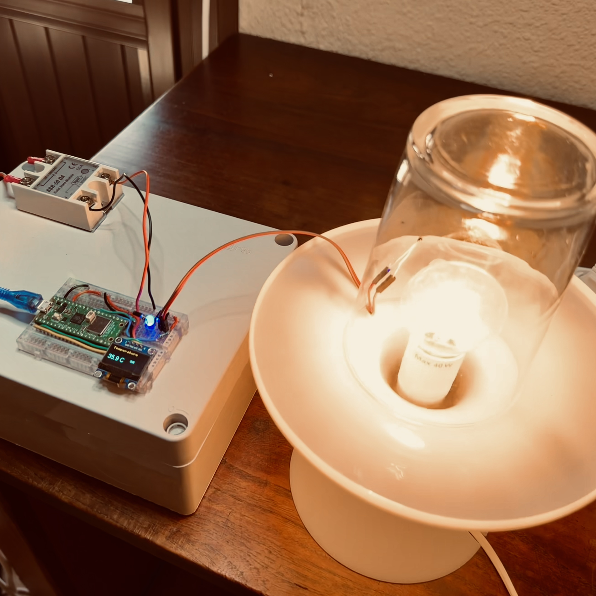 | 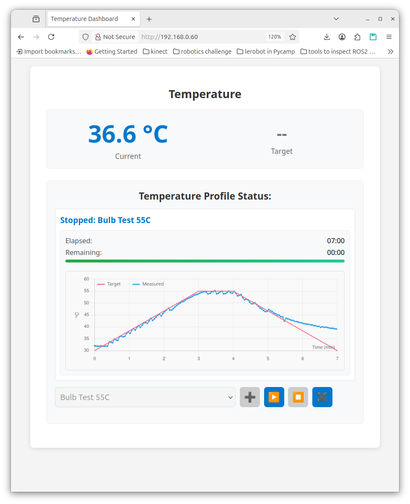 |
| ------------------------------------------------------- | ------------------------------- |

## Step 6 - (Finally) hacking the oven for real

Two sanity checks on the Cecotec oven before we proceed:

1. Two infrared heater pieces powerful enough (1000W) to quickly heat up and cool down
2. Confirmed that if we shut down and power up again the oven it resumes working (there are no electronics that reset the timer etc). This allows us controlling the oven as we did with the incandescent bulb in the proof of concept.
3. The lower tray for removing breadcrumbs is perfect to feed the wire of the thermocouple to get temperature measurements inside the oven without the need to drill a hole or modify the oven in any way.

### Firmware

Next we need to adapt the code for the K-type thermocouple and MAX6675. Refer to [this tutorial](https://www.electroniclinic.com/raspberry-pi-pico-and-max6675-based-industrial-temperature-monitoring-system/).


## WIP

- [ ] created branch `feature/polling-improvements-WIP` with partial implementation of incremental temperature updates instead of full dumps for the graph to enable higher refresh rates without memory problems, and to configure the refresh of different elements such as the graph, measured and target temperatures, UI buttons states, etc using centralized named constants instead of magic numbers scattered throughout the code
- [ ] check also open issues
- [x] test the oven and reflow first part
- [ ] add pictures and gifs

