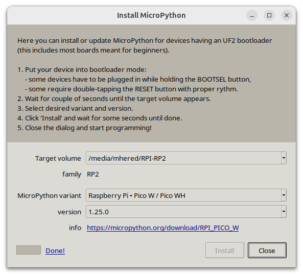

# DIY reflow oven

Inspired in [this video](https://www.youtube.com/watch?v=asZ1zhef8Ss) (see also the [blog post](https://www.digikey.com/en/maker/projects/how-to-build-a-solder-reflow-oven/6c52df4782084f8d97c62d1349df058f)) but the BOM was too expensive

Bought the following elements instead:

| Qty  | Item                                                         | Image                        | Description                                                  | Link                                          | Pack Price (€) | Pack Size | Unit Price (€) | Subtotal (€) |
| ---- | ------------------------------------------------------------ | ---------------------------- | ------------------------------------------------------------ | --------------------------------------------- | -------------- | --------- | -------------- | ------------ |
| 1    | [ARCELI MAX6675 module + K-type thermocouple](./BOM/sensor.md) |  | K-type thermocouple module with MAX6675, 0–600 °C range, SPI output | [Amazon](https://www.amazon.es/dp/B07MY36P9Y) | 7.99           | 1         | 7.99           | 7.99         |
| 1    | [SSR-50DA Solid State Relay](./BOM/ssr.md)                   |     | DC 3–32 V input, AC 24–380 V output, 50A max, for heater control | [Amazon](https://www.amazon.es/dp/B08FX1DDJM) | 9.59           | 1         | 9.59           | 9.59         |
| 1    | [Cecotec Bake&Toast 1090 Oven](./BOM/oven.md)                |    | 10 L tabletop oven, 1000 W, 60 min timer, up to 230 °C       | [Amazon](https://www.amazon.es/dp/B0BQ13YSVT) | 31.90          | 1         | 31.90          | 31.90        |
| 1    | Raspberry Pico WH                                            |                              |                                                              |                                               |                |           |                |              |
| 1    | SSD1306 OLED                                                 |                              |                                                              |                                               |                |           |                |              |

Also used a Raspberry Pico WH and a SSD1306 OLED screen I had around

## Step 1 - Measure temp and show it on the OLED

Target: display the temperature on the OLED using a MicroPython script

Inspired in this source video: https://www.youtube.com/watch?v=aUPvASe8D-w

### Flashing MicroPython onto the Pico

I used [Thonny](https://thonny.org/) (a python IDE for beginners with great MicroPython integration). 

1. Install and run:

```bash
$ sudo apt install thonny
$ thonny
```

2. plug the RPi Pico in boot mode: while holding down the **BOOTSEL** button on the RPi Pico, connect the USB cable to your computer, and a new drive will appear: **RPI-RP2**

3. flash MicroPython on the RPi Pico: 
   1. Go to **Tools** > **Options**
   2. In the **Interpreter** tab select **"MicroPython (Raspberry Pi Pico)"** in the dropdown and click **"Install or update MicroPython"**. Thonny will detect the RPi Pico automatically. 
   3. Select variant **"Raspberry Pi Pico W / Pico WH"**. It will download and flash the **MicroPython UF2 file** automatically.
   4. Click **Install** and wait for it to finish
   5. After install, the RPi Pico will reboot and connect directly to Thonny — you’ll see the MicroPython REPL (>>>) at the bottom.


### RPi Pico WH pinout


### Wiring the voltage divider

```
3.3V --- [10kΩ] ---+--- [10K Thermistor] --- GND
                   |
                GPIO26 (ADC 0)
```

### Wiring the SSD1306 OLED to the Pico

| OLED Pin | Connect To Pico | Pico Pin Number | Function |
| -------- | --------------- | --------------- | -------- |
| `VCC`    | 3.3V            | Pin 36          | Power    |
| `GND`    | GND             | Pin 38 or 3     | Ground   |
| `SCK`    | GP1             | Pin 2           | I²C0 SCL |
| `SDA`    | GP0             | Pin 1           | I²C0 SDA |

### Wiring


### Pico Firmware

* `main.py` - main function.
* `display.py` - functions to send info to the OLED display  
* `thermistor.py` -  functions to read the sensor

Copy dependencies to the pico:

* `ssd1306.py` - library to communicate with the OLED (copied from https://github.com/stlehmann/micropython-ssd1306)
* `writer.py` - an interpreter for custom fonts for the OLED
* `freesans20.py` - a custom large font for the OLED 

Note: the files from https://github.com/peterhinch/micropython-font-to-py did not work for me, so I copied them instead from the link in the comments of this video: https://www.youtube.com/watch?v=bLXMVTTPFMs

## Step 2  - setup a web server over WiFi to interact from computer or phone

* `wifi.py` : function to connect the RPi Pico to Wifi
* `secrets.py`: contains network information

```bash
SSID = "Network"
PASSWORD = "Password"
```

* `server.py` :  a very basic web server


## Step 3 - Control the heater

Next we refactor using [Microdot](https://github.com/miguelgrinberg/microdot) framework and add a few improvements:

* Replace repeated full-page reload every 2 seconds using meta-refresh with polling a tiny JSON file using Java Script. This is more efficient, avoids page flicker and is more extensible 
* Save web page as static files (`index.html` and `style.css`) with a minimalistic, modern design
* Add `/set_target?value=XX` route to update target temperature via HTTP
* Add REST endpoint `/temperature` exposing current and target temp + heater state

* `heater.py` - contains the target temperature logic and functions to control a heater in GPIO22

We copy the library to the pico: `microdot.py`.


### Wiring
|  |  |
| ---------------------------------- | ---------------------------- |


## Step 4 - Temperature Profiles

Next we refactor to add support for temperature profiles and disable manual target temperature setting.

- `profile.py` - classes for multi-phase temperature control with JSON serialization
- `profile_manager.py` functions to manage profile execution, file persistence, and state tracking
- new `profiles/` folder to store temperature profiles as JSON files
  - [low_temp.json](./src/profiles/low_temp.json) profile based on [this datasheet](./assets/low_temp_solder_paste_datasheet.pdf) for Sn42Bi57Ag1 Low Temperature Solder Paste


## Step 5 - Plot temperature graphs


## Sources

* [Freenove_Ultimate_Starter_Kit_for_Raspberry_Pi](https://github.com/Freenove/Freenove_Ultimate_Starter_Kit_for_Raspberry_Pi) - a kit I use, the repo has tutorials, specs of the components etc 

* [Online Steinhart-Hart model coefficients calculator]( https://www.thinksrs.com/downloads/programs/therm%20calc/ntccalibrator/ntccalculator.html) - needs R measurements at 3 known T points
* [Another video](https://www.youtube.com/watch?v=k9xzGO0SVg0) -  discusses temp curves, has a custom controller PCB

